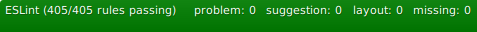

## Code analysis ⚙️📈📈

## Deployment🚀🚀🚀

## Design💧💧💧

## Team Monkeys🐒🐒🐒

## Тимлид: Леонид Перлин 

| Имя              |    Роль      |
|------------------|--------------|
| [Леонид Перлин](https://github.com/perlinleo)     🥵 | Fullstack |
| [Ильягу Нагдимаев](https://github.com/Ilyagu)  🐒 | Fullstack |
| [Михаил Попов](https://github.com/4Marvin2)    😭 | Fullstack |
| [Владимир Лункин](https://github.com/VladimirLunkin)  🕵️ | Fullstack |
